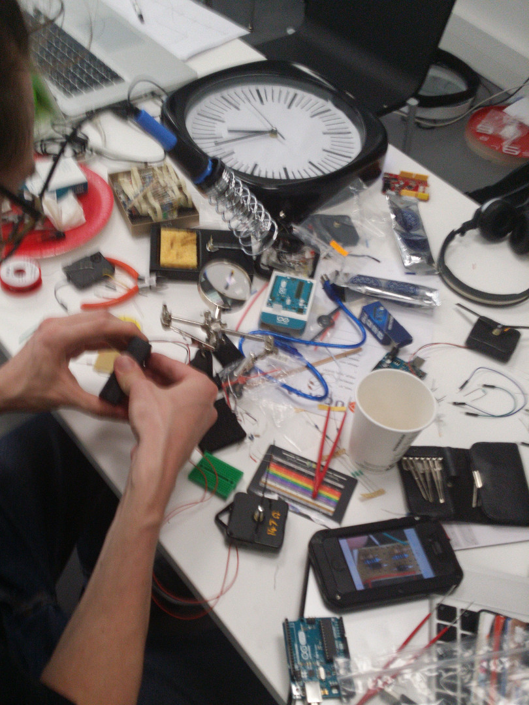
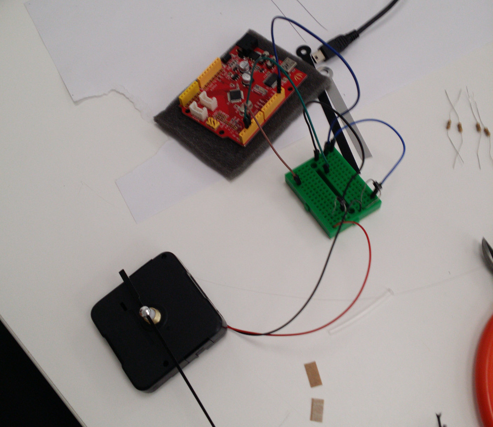

#Bidouiller le temps
====================

A project by [Bachir Soussi Chiadmi](http://bachirsoussichiadmi.net) and [Julien gargot](http://gargot.co) from [g-u-i.net](http://www.g-u-i.net) @[arthakday's Disnovate](http://www.arthackday.net/events/disnovate)

##What if basic time clocks were not totally accurate ?
-------------------------------------------------------
We started from the [cibomahto.com project](http://www.cibomahto.com/2008/03/controlling-a-clock-with-an-arduino/) to run the quartz clock with an arduino. Then we improved (or disinovated) the code to alter time. The idea is that the clock will show regularly the right time (every hours or every 10min or ..., you chose) but between these points, time will be altered, runing to slow or to fast.

####Sources for hacking quartz clocks with arduino
http://www.abbeyclock.com/quartz.html

http://www.cibomahto.com/2008/03/controlling-a-clock-with-an-arduino/

http://sound.westhost.com/clocks/timebase.html

http://sound.westhost.com/clocks/motors.html

####Sources for easing algorithmes
http://upshots.org/actionscript/jsas-understanding-easing

http://gizma.com/easing/

